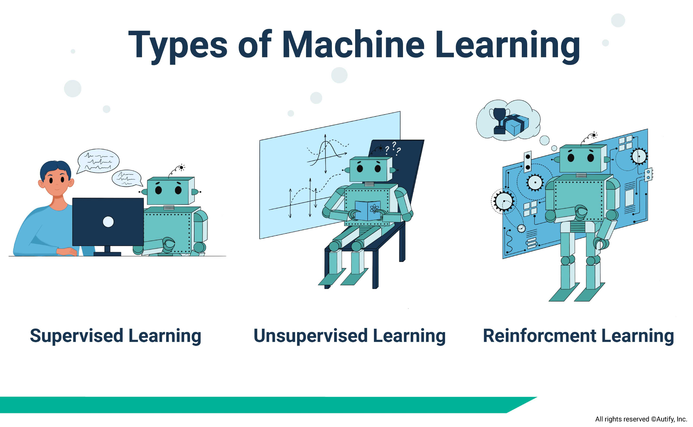

# Data_Science_and_Machine_Learning

## Name: Alina Ali

## Instructor: Dr. Randy R. Davila

## Course: DATA 4319 - Statistical and Machine Learning 

## University of Houston-Downtown

---

    

---

## Textbook:

- Hands-On Machine Learning with Scikit-Learn, Keras, and TensorFlow, 2nd Edition, by Aurélien Géron
- Machine Learning with Python for Everyone, Addison Wesley Data & Analytics Series, 2020 Pearson Education, by Mark E. Fenner

## Course Description:

This repository is created for a Statistical and Machine Learning course (Data 4319). This repository includes data science and machine learning algorithms and it is purely based on Python langauage. The main topics are supervised learning and unsupervised learning. 

## Types of Machine Learning:

There are three types of machine learning.

1. Supervised Learning
2. Unsupervised Learning
3. Reinforcement Learning
---

    

---

- Supervised Learning:

 1. Linear Regression
 2. Gradient Descent
 3. Logistic Regression
 4. Neural Nets
 5. Support Vector Machines
 6. k-Nearest Neighbors
 7. Decision/ Regression Trees
 8. Ensemble Learning
 

- Unsupervised Learning:

 1. k-Means Clustering
 2. Principle Component Analysis

## Data Sets

1. Penguins
This is a public data from seaborn. seaborn.load_dataset("penguins"). [link to Website](https://seaborn.pydata.org/generated/seaborn.load_dataset.html)

2. Heart Disease
<<<<<<< HEAD
This is a public data from Kaggle. [link to Kaggle data](https://www.kaggle.com/datasets/johnsmith88/heart-disease-dataset)
=======
This is a public data from Kaggle [link to Kaggle data](https://www.kaggle.com/datasets/johnsmith88/heart-disease-dataset)
>>>>>>> 70d82846727aa77be9073c402a5f3452ebf468c1

3. Diabetes
This is a public data from sklearn, load.diabetes [link to Website](https://scikit-learn.org/stable/modules/generated/sklearn.datasets.load_diabetes.html#sklearn.datasets.load_diabetes)

4. Fashion MNIST
This is a public data from TensorFlow, fashion.load_data() [link to Website](https://www.tensorflow.org/datasets/catalog/fashion_mnist)
