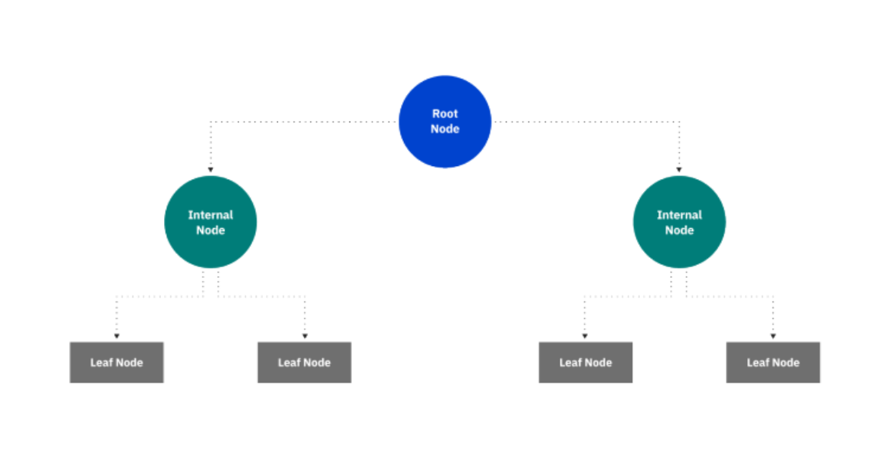

# Decision Tree

Decision tree builds regression or classification models in the form of a tree structure. It breaks down a dataset into smaller and smaller subsets while at the same time an associated decision tree is incrementally developed. The final result is a tree with decision nodes and leaf nodes. 

It uses a decision tree (as a predictive model) to go from observations about an item (represented in the branches) to conclusions about the item's target value (represented in the leaves). Tree models where the target variable can take a discrete set of values are called classification trees; in these tree structures, leaves represent class labels and branches represent conjunctions of features that lead to those class labels. 

 ---

    

---

Decision trees used in data mining are of two main types:

- Classification tree analysis is when the predicted outcome is the class (discrete) to which the data belongs.
- Regression tree analysis is when the predicted outcome can be considered a real number (e.g. the price of a house, or a patient's length of stay in a hospital).

# Regression Tree

A regression tree is basically a decision tree that is used for the task of regression which can be used to predict continuous valued outputs instead of discrete outputs.
Regression Trees work in principal in the same way as Classification Trees with the large difference that the target feature values can now take on an infinite number of continuously scaled values. Hence the task is now to predict the value of a continuously scaled target feature Y given the values of a set of categorically (or continuously) scaled descriptive features X.

# Heart Disease Dataset for Decision Tree

The data used for this model is a public data from Kaggle [link to Kaggle data](https://www.kaggle.com/datasets/johnsmith88/heart-disease-dataset)

# Diabetes Dataset for Regression Tree
The data used for this model is a public data from sklearn, load.diabetes [link to Website](https://scikit-learn.org/stable/modules/generated/sklearn.datasets.load_diabetes.html)

# Libraires

- Pandas https://pandas.pydata.org/
- Matplotlib https://matplotlib.org/
- Numpy https://numpy.org/
- Seaborn https://seaborn.pydata.org/
- Scikit-learn https://scikit-learn.org/
