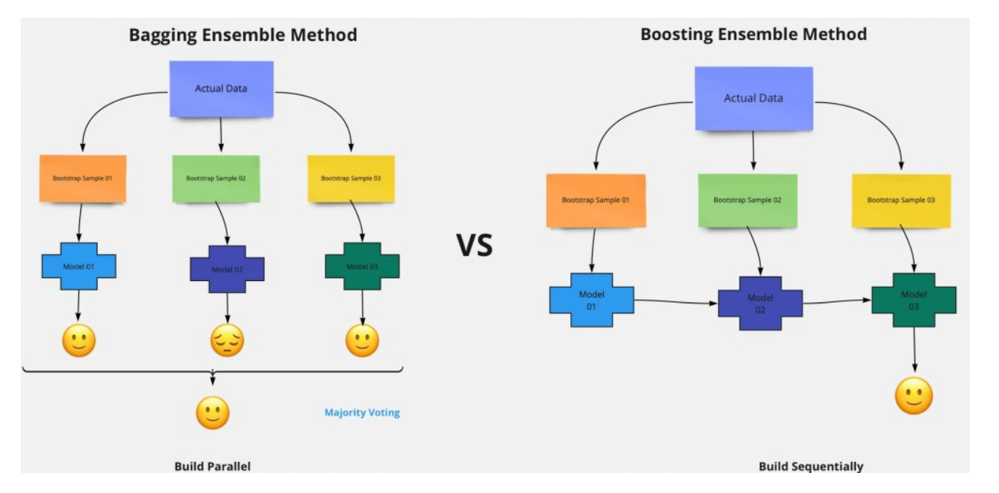

# Ensemble Method

Ensemble method in Machine Learning is defined as the multimodal system in which different classifier and techniques are strategically combined into a predictive model (grouped as Sequential Model, Parallel Model, Homogeneous and Heterogeneous methods etc.) Ensemble method also helps to reduce the variance in the predicted data, minimize the biasness in the predictive model and to classify and predict the statistics from the complex problems with better accuracy.

 ---

    

---
The two Ensemble Methods that I am going to use is Bagging and Random Forest.

# Bagging

This ensemble method combines two machine learning models i.e. Bootstrapping and Aggregation into a single ensemble model.  The objective of the bagging method is to reduce the high variance of the model. The decision trees have variance and low bias. The large dataset is (say 1000 samples) sub-sampled (say 10 sub-samples each carries 100 samples of data).  The multiple decision trees are built on each sub-sample training data. While banging the sub-sampled data on the different decision trees, the concern of over-fitting of training data on each decision tree is reduced. For the efficiency of the model, each of the individual decision trees is grown deep containing sub-sampled training data. The results of each decision tree are aggregated to understand the final prediction. The variance of the aggregated data comes to reduce. The accuracy of the prediction of the model in the bagging method depends on the number of decision-tree used. The various sub-sample of a sample data is chosen 
randomly with replacement. The output of each tree has a high correlation.

 ---

    

---

# Random Forest

Random forest is a supervised machine learning algorithm that can be used for solving classification and regression problems both. However, mostly it is preferred for classification. It is named as a random forest because it combines multiple decision trees to create a “forest” and feed random features to them from the provided dataset. Instead of depending on an individual decision tree, the random forest takes prediction from all the trees and selects the best outcome through the voting process. 

# Advantages of Random Forest
- It can perform both regression and classification tasks.
- A random forest produces good predictions that can be understood easily.
- It can handle large datasets efficiently.
- The random forest algorithm provides a higher level of accuracy in predicting outcomes over the decision tree algorithm.

# Disadvantages of Random Forest
- When using a random forest, more resources are required for computation.
- It consumes more time compared to a decision tree algorithm.

 ---

    

---

# References

1. https://in.springboard.com/blog/machine-learning-algorithms-decision-tree-random-forest/
2. https://www.section.io/engineering-education/introduction-to-random-forest-in-machine-learning/
3. https://datamahadev.com/random-forests-in-machine-learning-a-detailed-explanation/