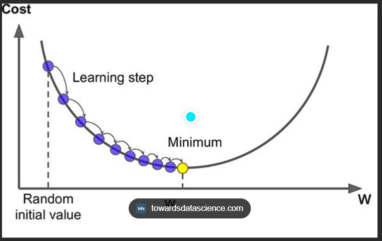

# Gradient Descent

Gradient descent is an optimization algorithm which is commonly-used to train machine learning models and neural networks.  Training data helps these models learn over time, and the cost function within gradient descent specifically acts as a barometer, gauging its accuracy with each iteration of parameter updates. Until the function is close to or equal to zero, the model will continue to adjust its parameters to yield the smallest possible error. Once machine learning models are optimized for accuracy, they can be powerful tools for artificial intelligence (AI) and computer science applications. 

Gradient descent was initially discovered by "Augustin-Louis Cauchy" in mid of 18th century. Gradient Descent is defined as one of the most commonly used iterative optimization algorithms of machine learning to train the machine learning and deep learning models. It helps in finding the local minimum of a function

 ---

    

---

# Types of Gradient Descent
Based on the error in various training models, the Gradient Descent learning algorithm can be divided into:
- Batch gradient descent
- Stochastic gradient descent
- Mini-batch gradient descent. 
