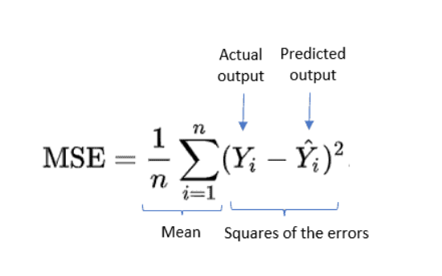

# Linear Regression

Linear regression is probably one of the most important and widely used regression techniques. It’s among the simplest regression methods. One of its main advantages is the ease of interpreting results.

Linear regression is one of the most applied and fundamental algorithms in machine learning. Python is one of the most in-demand skills for data scientists. These make learning linear regression in Python critical.

---

    

---
## What is Linear Regression in machine learning?
Linear Regression is a machine learning (ML) algorithm for supervised learning – regression analysis.

In regression tasks, we have a labeled training dataset of input variables (X) and a numerical output variable (y).

When applying linear regression, we want to find the best fit linear relationship between X and y. Then when we have new observations, we can use its input variables and the linear function f to predict its output value.

y = f(X)

When we have only one input variable, it is a simple linear regression. When there is more than one input variable, it is multiple linear regression.

Prediction is the common application of linear regression. We want this line to produce minimum errors when making predictions.
So, the goal is to minimize the difference between the predicted output and the actual output values.

The most used estimation method is (Ordinary) Least Squares (OLS), which targets minimizing the sum of squared residuals/errors. To achieve this, we use the cost function called Mean Squared Error (MSE), which is the average of the sum of squared residuals.

Assume we have n observations Y1, Y2, … Yn, the MSE formula is below:

---

    

---