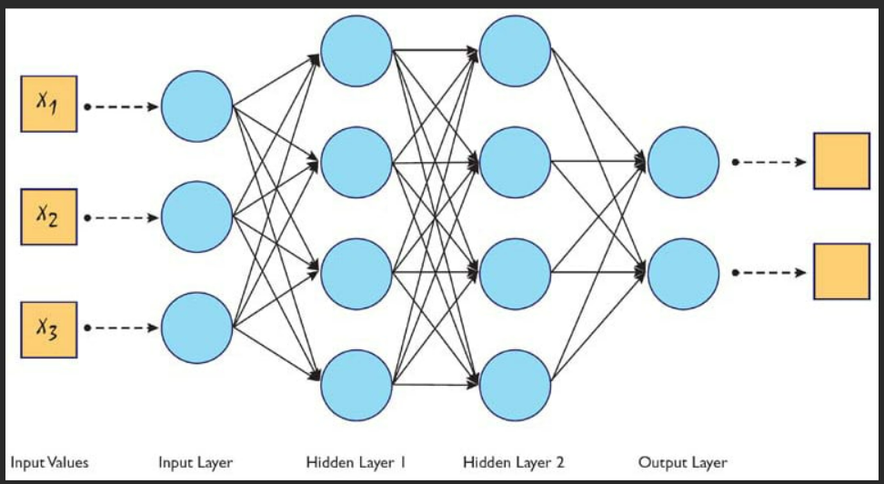

# Multilayer Perceptron

## Deep Neural Network

A deep neural network is a neural network with a certain level of complexity, a neural network with more than two layers. Deep neural networks use sophisticated mathematical modeling to process data in complex ways.

- This class of networks consists of multiple layers of computational units, usually interconnected in a feed-forward way.
- Each neuron in one layer has directed connections to the neurons of the subsequent layer.
- In many applications the units of these networks apply a sigmoid function as an activation function. However sigmoidal activation functions have very small derivative values outside a small range and do not work well in deep neural networks due to the vanishing gradient problem. 
- Alternatives to sigmoidal activation functions that alleviate the vanishing gradient problems and allow deep networks to be trained have been proposed.

A Multilayer Perceptron is a Neural Network that learns the relationship between linear and non-linear data. It is a multilayer perceptron network. It consists of at least three layers:

- An Input Layer
- One or more hidden layers
- An Output layer 

---

    

---