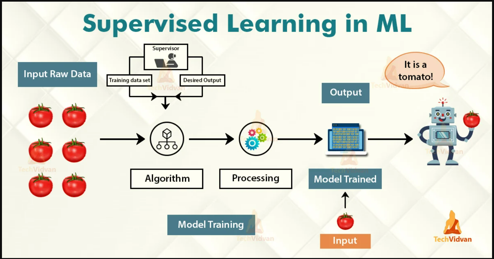

# Supervised Learning

It supervise the learning process, meaning the data that you have collected here is labelled and so you know what input needs to be mapped to what output. 
This helps you correct your algorithm if it makes a mistake in giving you the answer.

Supervised Learning is the process of making an algorithm to learn to map an input to a particular output. This is achieved using the labelled datasets that you have collected. If the mapping is correct, the algorithm has successfully learned. 
Else, you make the necessary changes to the algorithm so that it can learn correctly. 
Supervised Learning algorithms can help make predictions for new unseen data that we obtain later in the future. 

---

    

---

## Why is it Important? 
- Learning gives the algorithm experience which can be used to output the predictions for new unseen data
- Experience also helps in optimizing the performance of the algorithm
- Real-world computations can also be taken care of by the Supervised Learning algorithms

## Types of Supervised Learning:
Supervised Learning has been broadly classified into 2 types.

- Regression
- Classification

### Regression:
Regression is the kind of Supervised Learning that learns from the Labelled Datasets and is then able to predict a continuous-valued output for the new data given to the algorithm. 
It is used whenever the output required is a number such as money or height etc. 

### Classification:
Classification, on the other hand, is the kind of learning where the algorithm needs to map the new data that is obtained to any one of the 2 classes that we have in our dataset. The classes need to be mapped to either 1 or 0 which in real-life translated to ‘Yes’ or ‘No’, ‘Rains’ or ‘Does Not Rain’ and so forth.
The output will be either one of the classes and not a number as it was in Regression.

## Disadvantages of Supervised Learning
Supervised Learning has a lot of challenges and disadvantages that you could face while working with these algorithms. 
These inlcudes: 
- You could overfit your algorithm easily
- Good examples need to be used to train the data
- Computation time is very large for Supervised Learning
- Unwanted data could reduce the accuracy
- Pre-Processing of data is always a challenge
- If the dataset is incorrect, you make your algorithm learn incorrectly which can bring losses
