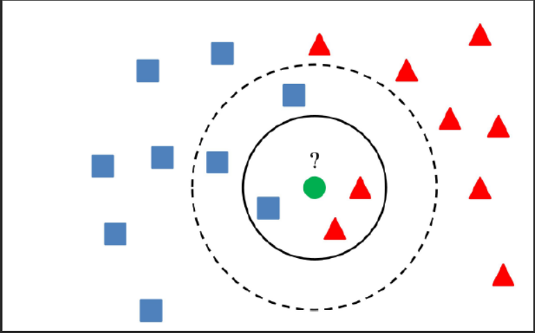

# K Nearest Neighbors

The k-nearest neighbors (KNN) algorithm is a data classification method for estimating the likelihood that a data point will become a member of one group or another based on what group the data points nearest to it belong to.

The k-nearest neighbor algorithm is a type of supervised machine learning algorithm used to solve classification and regression problems. However, it's mainly used for classification problems.

- KNN is a lazy learning and non-parametric algorithm.

- It's called a lazy learning algorithm or lazy learner because it doesn't perform any training when you supply the training data. Instead, it just stores the data during the training time and doesn't perform any calculations. It doesn't build a model until a query is performed on the dataset. This makes KNN ideal for data mining.

- It's considered a non-parametric method because it doesn’t make any assumptions about the underlying data distribution. Simply put, KNN tries to determine what group a data point belongs to by looking at the data points around it.

---

    

---