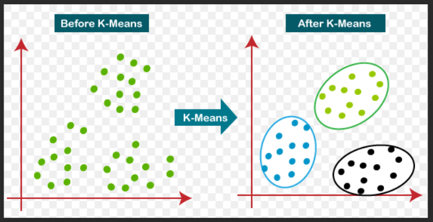

# K-Means Clustering

K-means algorithm is an iterative algorithm that tries to partition the dataset into Kpre-defined distinct non-overlapping subgroups (clusters) where each data point belongs to only one group. It tries to make the intra-cluster data points as similar as possible while also keeping the clusters as different (far) as possible. It assigns data points to a cluster such that the sum of the squared distance between the data points and the cluster’s centroid (arithmetic mean of all the data points that belong to that cluster) is at the minimum. The less variation we have within clusters, the more homogeneous (similar) the data points are within the same cluster.

 ---

    

---

# Advantages of K- Means Clustering Algorithm
Below are the advantages mentioned:

- It is fast
- Robust
- Easy to understand
- Comparatively efficient
- If data sets are distinct, then gives the best results
- Produce tighter clusters
- When centroids are recomputed, the cluster changes.
- Flexible
- Easy to interpret
- Better computational cost
- Enhances Accuracy
- Works better with spherical clusters

# Disadvantages of K- Means Clustering Algorithm
Below are the disadvantages mentioned:

- Needs prior specification for the number of cluster centers
- If there are two highly overlapping data, then it cannot be distinguished and cannot tell that there are two clusters
- With the different representations of the data, the results achieved are also different
- Euclidean distance can unequally weigh the factors
- It gives the local optima of the squared error function
- Sometimes choosing the centroids randomly cannot give fruitful results
- It can be used only if the meaning is defined
- Cannot handle outliers and noisy data
- Do not work for the non-linear data set
- Lacks consistency
- Sensitive to scale
- If very large data sets are encountered, then the computer may crash.
- Prediction issues

# References:

1. https://www.educba.com/k-means-clustering-algorithm/
2. https://towardsdatascience.com/k-means-clustering-algorithm-applications-evaluation-methods-and-drawbacks-aa03e644b48a

