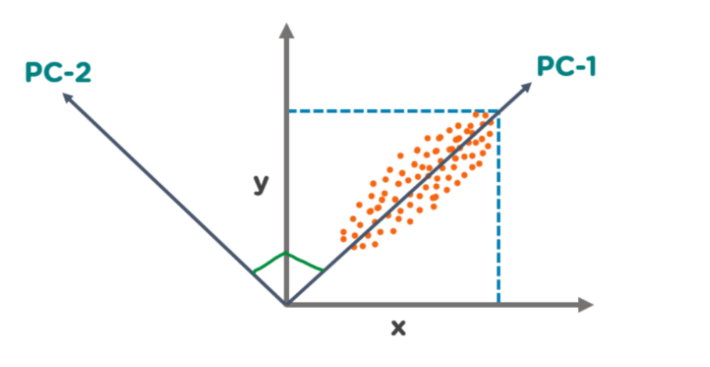

# Principal Component Analysis

The Principal Component Analysis is a popular unsupervised learning technique for reducing the dimensionality of data. It increases interpretability yet, at the same time, it minimizes information loss. It helps to find the most significant features in a dataset and makes the data easy for plotting in 2D and 3D. PCA helps in finding a sequence of linear combinations of variables.

 ---

    

---

# Principal Component

The Principal Components are a straight line that captures most of the variance of the data. They have a direction and magnitude. Principal components are orthogonal projections (perpendicular) of data onto lower-dimensional space.

- PCA is used to visualize multidimensional data.
- It is used to reduce the number of dimensions in healthcare data.
- PCA can help resize an image.
- It can be used in finance to analyze stock data and forecast returns.
- PCA helps to find patterns in the high-dimensional datasets.