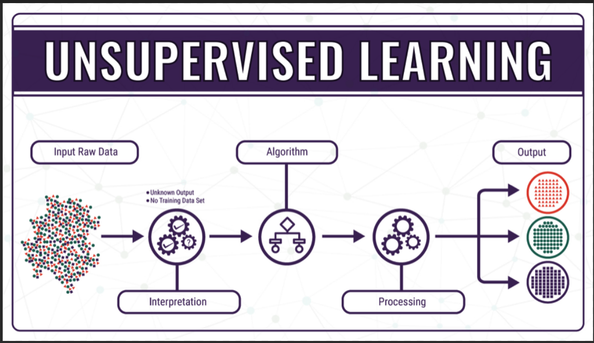

# Unsupervised Learning

Unsupervised learning, also known as unsupervised machine learning, uses machine learning algorithms to analyze and cluster unlabeled datasets. These algorithms discover hidden patterns or data groupings without the need for human intervention. Its ability to discover similarities and differences in information make it the ideal solution for exploratory data analysis, cross-selling strategies, customer segmentation, and image recognition.

Unsupervised learning typically falls within the following two reahlms:
- Clustering
- Dimensionality Reduction

 ---

    

---

# K-means Clustering
K means it is an iterative clustering algorithm which helps you to find the highest value for every iteration. Initially, the desired number of clusters are selected. In this clustering method, you need to cluster the data points into k groups. A larger k means smaller groups with more granularity in the same way. A lower k means larger groups with less granularity.

The output of the algorithm is a group of “labels.” It assigns data point to one of the k groups. In k-means clustering, each group is defined by creating a centroid for each group. The centroids are like the heart of the cluster, which captures the points closest to them and adds them to the cluster.

K-mean clustering further defines two subgroups:

- Agglomerative clustering
- Dendrogram

# Principal Components Analysis

 Principal component analysis (PCA) is an unsupervised technique used to preprocess and reduce the dimensionality of high-dimensional datasets while preserving the original structure and relationships inherent to the original dataset so that machine learning models can still learn from them and be used to make accurate predictions.
In case you want a higher-dimensional space. You need to select a basis for that space and only the 200 most important scores of that basis. This base is known as a principal component. The subset you select constitute is a new space which is small in size compared to original space. It maintains as much of the complexity of data as possible.

 ---

    

---

# Applications of Unsupervised Machine Learning

Some application of Unsupervised Learning Techniques are:

- Clustering automatically split the dataset into groups base on their similarities
- Anomaly detection can discover unusual data points in your dataset. It is useful for finding fraudulent transactions
- Association mining identifies sets of items which often occur together in your dataset
- Latent variable models are widely used for data preprocessing. Like reducing the number of features in a dataset or decomposing the dataset into multiple components

# Challenges of unsupervised learning
While unsupervised learning has many benefits, some challenges can occur when it allows machine learning models to execute without any human intervention. Some of these challenges can include:

- Computational complexity due to a high volume of training data
- Longer training times
- Higher risk of inaccurate results
- Human intervention to validate output variables
- Lack of transparency into the basis on which data was clustered

Unsupervised learning deals with unlabeled data. As such, the techniques used are vastly different than those found in supervised learning. Unsupervised learning typically falls within the following two reahlms:

- Clustering

- Dimensionality Reduction

# Reference

1. https://www.ibm.com/cloud/learn/unsupervised-learning
2. https://www.guru99.com/unsupervised-machine-learning.html